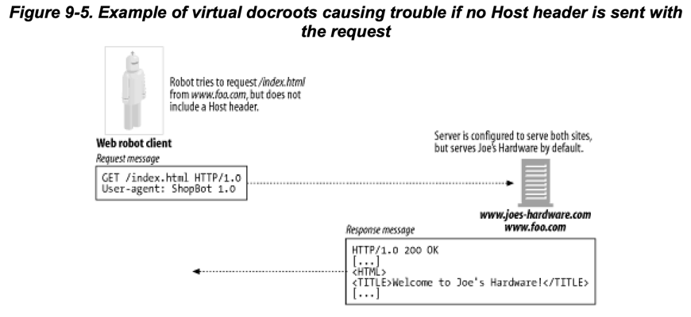
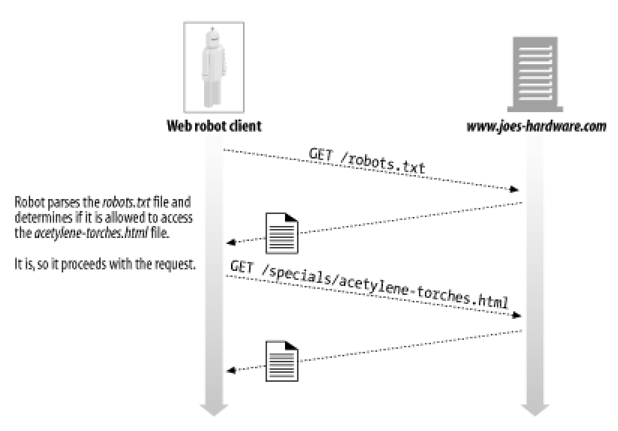

# 9장 웹 로봇

1. 크롤러와 크롤링
2. 로봇의 HTTP
3. 부적절하게 동작하는 로봇들
4. 로봇 차단하기
5. 로봇 에티켓
6. 검색엔진

---

### 웹 로봇?

- 사람과의 상호작용 없이 연속된 웹 트랜잭션을 자동으로 수행하는 소프트웨어 프로그램
- 웹 로봇은 웹사이트를 떠돌아다니며 콘텐츠를 가져오고, 하이퍼링크를 따라가고, 발견한 데이터를 처리
- 방식에 따라 크롤러, 스파이더, 웜, 악성 로봇 등으로 불림

### 웹 로봇 예시

- 주식시장 서버에 분마다 HTTP GET 요청에 대한 응답을 기준으로 그래프 작성
- WWW 웹 규모, 진화에 대한 통계 정보를 수집하는 조사 로봇 (페이지 개수, 크기, 언어, 미디어 타입 등)
- 검색엔진 로봇 : 검색 데이터베이스를 만들기 위해 문서를 수집
- 가격비교 로봇 : 상품에 대한 가격 데이터베이스를 만들기 위해 쇼핑몰 카탈로그의 웹페이지를 수집

## 1. 크롤러와 크롤링

- 웹 크롤러 (web crawler) : 웹페이지에 대한 모든 하이퍼링크를 방문해가며 재귀적으로 웹페이지를 탐색하는 로봇
    - 크롤러, 스파이더라고 불림
- e.g. 검색엔진은 웹 크롤러를 사용해 모든 문서를 끌어옴
    - 그 이후 검색 데이터베이스 구축 -> 사용자는 특정 단어를 포함한 문서 검색 가능

### 1.1 어디에서 시작하는가: '루트 집합' (Root Set)


- 루트 집합 : 크롤러가 방문을 시작하는 URL 초기 집합
- 루트집합에서 시작해 모든 문서를 수집해야함
- 위 그림에서는 루트 집합에 `A`, `G`, `S` 면 충분함

### 1.2 링크 추출과 상대 링크 정상화

- 웹을 돌아다니며 꾸준히 HTML 문서 검색 -> 그 안의 URL 링크를 파싱해 크롤링 대상에 추가
- 새링크를 발견할수록 목록이 기하급수적으로 늘어남
- 따라서 상대링크를 절대링크로 변환하여 크롤링 대상에 추가해야함
    - 상대링크 : 현재 문서를 기준으로 한 링크
    - 절대링크 : 문서의 위치와 상관없이 항상 같은 링크

### 1.3 순환 피하기


- a. 로봇은 `A`를 방문하고 `B` 를 크롤링 대상에 추가
- b. 로봇은 `B`를 방문하고 `C` 를 크롤링 대상에 추가
- c. 로봇은 `C`를 방문하고 `A` 를 크롤링 대상에 추가
- `A` -> `B` -> `C` -> `A` 순환 발생
- 로봇들은 자기가 어딜 방문했었는지 반드시 알아야함

### 1.4 루프와 중복 (dups)

- 루프(loop)는 크롤러가 루프에 빠져 무한정으로 같은 문서를 방문하게함
    - 크롤러가 대역폭을 다 차지하고, 추가적인 페이지를 수집할 수 없음
- 웹 서버 성능 저하: 크롤러가 반복적으로 같은 문서를 요청하면 웹 서버는 반복적으로 같은 문서를 전송해야함
- 중복 문서 : 크롤러가 이미 방문한 문서
    - 크롤러 애플리케이션에는 중복 문서로 가득참
    - e.g. 검색엔진에 검색하면 똑같은 문서가 여러개 나옴

### 1.5 빵 부스러기의 흔적

- 방문 이력을 유지하기 위한 복잡한 자료구조가 필요
- 크롤러가 방문한 모든 문서를 기록하는 것은 불가능
    - 웹은 너무 커서
    - 크롤러가 방문한 모든 문서를 기록하면 메모리가 부족해짐
- 크롤러가 빠르게 방문 여부를 검색할 수 있는 검색트리, 해시 테이블이 필요

#### 트리와 해시 테이블

- URL 방문 이력을 검색트리나 해시테이블로 유지
- URL을 훨씬 빨리 검색할 수 있음

### 느슨한 존재 비트맵

- 존재 비트 배열 (presence bit array) 와 같은 느슨한 자료구조
- URL을 크롤링하면, URL 별로 해시 함수를 사용해 고정된 크기의 비트 배열을 만들고 존재 비트 생성
- 존재 비트가 이미 존재하면, 해당 URL은 이미 방문한 것으로 간주

### 체크포인트

- 크롤러가 중단 (shutdown)되면, 다시 시작할 때 중복 문서를 방문하지 않도록 체크포인트를 사용
- 디스크에 저장

### 파티셔닝

- 크롤러가 웹을 돌아다니며 수집하는 문서의 수가 너무 커져 하나의 컴퓨터로는 불가능
- farm : 한대의 컴퓨터(크롤러) 가 동시에 일함
    - 각 로봇들은 특정 URL 부분에 할당되어 책임을 지고 크롤링

### 1.6 별칭 (alias)와 로봇 순환

- 별칭 : 같은 문서를 가리키는 여러 URL
- 별칭이 달라도 동일한 문서를 가리키는 경우가 있음


### 1.7 URL 정규화하기 (Canonicalizing)

- 정규화하여 별칭이 동일한 URL을 가리키고있으면 제거
- 방법 1. 포트 번호가 명시되어있지 않다면 <host>:80으로 정규화
- 방법 2. 모든 %xx 이스케이핑 문자열을 변환
- 방법 3. # 태그 제거

### 1.8 파일 시스템 링크 순환


- 심벌링 링크 (symbolic link) : 파일 시스템의 파일을 가리키는 특별한 파일
- 위 두 그림은 모두 `/index.html` 문서에서 `subdir/index.html` 로 가는 링크가 있음
- 심벌릭 링크는 웹 크롤러가 루프에 빠지게 만듬
    - `GET /index.html` -> `GET /subdir/index.html` -> `GET /subdir/index.html` -> ...

### 1.9 동적 가상 웹 공간


- 동적 가상 웹 공간 (dynamic virtual web space) : 웹 서버가 URL을 생성하는 방법
- e.g. 게이트웨이 애플리케이션이 가상의 URL이 포함된 문서를 즉석에서 만들어냄
- URL과 HTML이 매번 달라 순환인지 알 수 없음

### 1.10 루프와 중복 피하기

- 완벽한 방법은 없음, 아래와 같이 휴리스틱한 방법을 조합해 사용
- 일반적으로 크롤러가 자율적일수록 루프에 빠짐 (trade-off)

#### URL 정규화

- URL을 표준 형태로 변환하여 같은 리소스에 대한 중복 URL 식별

### 너비 우선 크롤링

- 크롤링 대상의 큰 URL 집합을 가짐
- URL들을 너비우선으로 스케쥴링하여 탐색

#### 스로틀링

- 로봇이 웹 사이트에서 일정 시간동안 크롤링할 페이지 숫자를 제한

#### URL 크기 제한

- 로봇이 일정 길이 (보통 1KB)를 초과하는 URL 크롤링 거부
- 순환으로 URL이 길어지고 있다면 순환 중단됨

#### URL/사이트 블랙리스트

- 순환이나 함정을 만드는 사이트나 URL 목록을 블랙리스트에 추가
- 대부분의 대규모 크롤러들은 다양한 형태의 블랙리스트를 사용

#### 패턴 발견

- URL을 분석해 순환을 발견하는 패턴을 찾음
- e.g. `/subdir/index.html/subdir/index.html/subdir/index.html/...`

#### 콘텐츠 지문 (fingerprint)

- 컨텐츠 전체에 대한 몇 byte 기반으로 checksum을 계산
    - checksum : 페이지에 대한 간략한 표현, 지문
- 두 문서가 서로 달라도 같은 지문을 가질 수 있음
- 방해요소 : 동적인 컨텐츠 (날짜 등)

#### 사람의 모니터링

- 로봇은 결국 자기가 해결하지 못할 문제에 봉착하게됨
- 모니터링하여 특이한 일이일어나면 즉각 인지 후 진단, 조치하도록 설계되어야함

## 2. 로봇의 HTTP

- 로봇은 HTTP 클라이언트 : 스스로 HTTP 요청을 만들어감
- 많은 로봇들이 HTTP/1.0 사용 (HTTP 요구사항이 적기 떄문)

### 2.1 요청 헤더 식별하기

- 로봇들은 `User-Agent` 헤더를 사용해 자신을 식별
- 잘못된 크롤러 소유자 식별, 서어베게 로봇의 종류 등을 알려줄 떄 유용
- `User-Agent` : 서버에게 로봇의 이름을 알려줌
- `From` : 로봇 소유자의 이메일 주소를 알려줌
- `Accept` : 로봇이 받아들일 수 있는 미디어 타입을 알려줌
    - 즉, 로봇이 관심있어하는 컨텐츠
- `Referer` : 로봇이 요청한 URL이 포함된 문서 URL
    - 즉, 로봇이 어디서 URL을 발견하여 요청하였는가

### 2.2 가상 호스팅



- HTTP/1.1은 `Host` 헤더를 사용해 가상 호스팅을 지원
- 위 그림에서 크롤러는 `Host` 헤더 없이 `GET /index.html HTTP/1.0` 요청을 보냄
    - 서버는 가상 호스팅으로 2가지를 운영 중이고 기본 호스팅은 `www.joes-hardware.com` 임
    - 서버는 `Host` 헤더가 없는 요청을 받으면 기본 호스팅으로 처리
    - `www.joes-hardware.com/index.html` 을 응답

### 2.3 조건부 요청

- 조건 : 변경된 문서만 크롤링, 한정된 수의 문서를 크롤링 등
- 조건부 요청 : 문서가 변경되었는지 확인하기 위해 서버에 요청하는 것
    - 마치 HTTP 캐시의 리소스 로컬 사본의 유효성을 원서버와 비교

### 2.4 응답 다루기

- 대다수의 로봇은 단순 GET 요청이라 응답을 다루지 않음
- 특정 로봇 (조건부 요청을 하는) 들은 응답을 다룰 필요도 있음

### 상태 코드

- 모든 로봇은 `200 OK`, `404 Not Found` 등의 상태 코드를 다룸
- 에러가 없더라도 `200 OK` 를 응답하는 서버도 있음

### 엔터티

- 메타 `http-equiv` 태그, HTML `meta` 태그는 리소스에 대한 컨텐츠 저자가 표시한 정보

````html

<meta http-equiv="Refresh" content="1; URL=index.html">
````

- 위 태그를 포함하여 응답하면 수신자는 마치 HTTP 응답의 `Refresh : 1; URL=index.html` 헤더가 포함된 것처럼 동작
- 몇 서버는 `meta` 태그를 파싱하여 친절하게 응답 메시지 헤더에 포함해주기도 함

### 2.5 User-Agent Targeting

- 웹 관리자들은 많은 로봇들이 자신의 사이트를 방문하는 것을 대비해야함
- 특정 브라우저에 지원하는 사이트를 개발하면서 여러 브라우저, 로봇에 대응할 수 있는 유연한 사이트 개발할 수 있음
- 최소한, 로봇이 사이트에 방문했다가 컨텐츠를 식별하지 못하는 황당한 일이 없도록 대비 필요

## 3. 부적절하게 동작하는 로봇들

#### 폭주하는 로봇 (Runaway robots)

- 로봇은 사람보다 훨씬 빠르게 HTTP 요청을 보냄
- 문제가 발생했거나, 순환에 빠졌다면 타겟 웹서버에 극심한 부하를 줌
- 폭주 방지를 위한 보호장치 마련 필수

#### 오래된 URL

- 존재하지 않는 URL을 무수히 요청해서 웹 서버에 부하를 줌

#### 길고 잘못된 URL

- 순환이나 오류로 웹 사이트에 의미없는 길고 의미없는 URL을 반복해서 요청
- 웹서버 access log를 더럽히고, 웹 서버에 부하를 줌

#### 호기심이 지나친 로봇

- 사적인 데이터에 대한 URL을 얻어 검색엔진에 노출
- 이러한 컨텐츠를 제거하는 로봇의 메커니즘 필수
- 구글은 URL이 제거되더라도 크롤링한 페이지를 별도 보관해서 일정시간동안 여전히 검색이 가능해짐

#### 동적 게이트웨이 접근

- 게이트웨이 애플리케이션에 대한 URL을 크롤링
- 이러한 데이터는 특수 목적, 처리 비용이 많이 듦

## 4. 로봇 차단하기



- robots.txt : 로봇의 접근 제어 정보를 저장하는 파일
    - = Robots Exclusion Standard
- 웹서버의 document root에 robots.txt 파일을 두면 로봇은 이 파일을 읽어 접근 제어 정보를 얻음

### 4.1 로봇 차단 표준 (The Robots Exclusion Standard)

- 임시 방편으로 마련된 표준
- 대부분 v0.0, v1.0을 채택

| version | title                                    | description                         | Date |
|---------|------------------------------------------|-------------------------------------|------|
| 0.0     | A Standard for Robot Exclusion           | 로봇 배제 표준 Disallow 지시자 지원            | 1994 |
| 1.0     | A Method for Web Robots Control          | 로봇 제어 방법 Allow 지시자 추가               | 1996 |
| 2.0     | An Extended Standard for Robot Exclusion | 확장 표준, 정규식, timing 정보 등 (잘 사용되지 않음) | 1996 |

### 4.2 웹 사이트와 robots.txt 파일들

- 웹사이트는 단 하나의 robots.txt 파일만 가질 수 있음
- 가상 호스팅 환경에서 각 호스팅마다 robots.txt 파일을 가질 수 있음

#### robots.txt 가져오기

````Bash
GET /robots.txt HTTP/1.0
Host: www.joes-hardware.com
User-Agent: WebCrawler/1.1
Date: Tue, 11 Aug 1998 18:57:33 GMT
````

- `GET`으로 가져옴
- `text/plain` 으로 본문을 반환
- 만일 `404 Not found` 를 응답한다면, 제어가 없는 것으로 간주 모든 문서를 크롤링

#### 응답 코드

- 로봇은 `GET /robots.txt` 요청에 대한 응답에 따라 다르게 동작
- `200 OK` : robots.txt 파일이 존재, 로봇은 robots.txt 을 파싱하여 규칙을 지켜가며 크롤링
- `404 Not Found` : robots.txt 파일이 존재하지 않음, 로봇은 모든 문서를 크롤링
- `403 Forbidden` or `401 Unauthorized` : 로봇은 모든 문서를 크롤링하지 않음
- `500 Internal Server Error` : 크롤링을 다음으로 미룸
- `3xx` : 로봇은 `Location` 헤더를 따라가며 크롤링

### 4.3 robots.txt 파일 포맷

```text
# 이 robots.txt 파일은 www.joes-hardware.com 에서 사용됩니다.
# 크롤러 Slurp, Webcralwer가 허용됩니다.

User-agent: Slurp
User-agent: WebCrawler
Disallow: /private

User-agent: *
Disallow:
```

- Slurp, WebCrawler 는 `/private` 디렉토리를 크롤링하지 않음
- 그 외 Agent는 모든 디렉토리 크롤링 불가능

#### User-Agent line

````text
User-Agent: <robot-name>
or
User-Agent: *
````

- 로봇의 GET 요청의 `User-Agent` 헤더를 사용해 로봇을 식별
- 만일 <robot-name>에도 없고, `*` 에도 없다면 어떠한 제한도 없음

#### Disallow, Allow lines

- `Disallow` : 로봇이 크롤링하지 말아야할 디렉토리
- `Allow` : 로봇이 크롤링해도 되는 디렉토리

#### Disallw/Allw 접두 매칭 (prefix matching)

| 규칙 경로 | URL           | 결과 | 비고                        |
|-------|---------------|----|---------------------------|
| /tmp  | /tmp          | O  | 정확히 일치                    |
| /tmp  | /tmpfile.html | O  | 규칙경로가 URL의 접두 부분          |
| /tmp  | /tmp/dir.html | O  | 규칙경로가 URL의 접두 부분          |
| /tmp/ | /tmp          | X  | 규칙경로가 /tmp/는 URL의 접두어가 아님 |
|       | README.txt    | O  | 빈 문자열은 모든 URL에 일치         |

### 4.4 그 외에 알아둘 점

- robots.txt 파일은 명세가 발전함에 따라 추가적인 필드가 있을 수 있음
- 하위 호환성 : 한 줄을 여러줄로 나누어 적지 않아야함
- 주석은 파일 어디에든 위치
- v0.0은 Allow 미지원
    - 몇 보수적인 로봇들은 Allo를 무시하므로 컨텐츠 수집이 안될 수 있음

### 4.5 robots.txt의 캐싱과 만료

- 매 수집마다 robots.txt 파일을 가져오는 것은 비효율적
- robots.txt 파일은 변경될 가능성이 적으므로 캐싱해도 무방
- HTTP 캐시 제어 메커니즘을 원서버, 로봇 양쪽에 사용
- 로봇은 응답의 `Cache-Control`, `Expires` 헤더를 확인해 캐시된 robots.txt 파일을 사용

### 4.6 로봇 차단 Perl code

- robots.txt와 상효작용하는 공개된 Perl 라이브러리들이 있음
- e.g. `WWW::RobotRules` 모듈
    - 파싱된 robots.txt를 객체에 담아두고, 주어진 URL에 접근 가능한지 확인하는 메서드 제공

```
require WWW::RobotRules;

# 로봇 이름 SuperRobot으로 객체 생성
my $robotsrules = new WWW::RobotRules 'SuperRobot/1.0';
use LWP::Simple qw(get);

# 죠의 하드웨어 사이트의 robots.txt를 가져옴, 파싱, 규칙
$url = 'http://www.joes-hardware.com/robots.txt';
my $robots_txt = get $url;
$robotsrules->parse($url, $robots_txt);

# 타겟 검사
if($robotsrules -> allowed($some_target_url)){
    # 타겟에 접근 가능
} else {
    # 타겟에 접근 불가능
}
```

### 4.7 HTML 로봇 제어 META 태그

- HTML 파일 자체에서 로봇 제어를 하는 방법

````html

<html>
<head>
    <meta name="robots" content="directive-list">
</head>
<body>
...
</body>
</html>
````

#### 로봇 META 지시자

- 지시자에는 몇가지 종류가 있으며, 점차 추가될 가능성이 있음
- 대표적으로 `NOINDEX`, `NOFOLLOW` 가 있음

#### NOINDEX

- 로봇에게 이 페이지를 처리하지 말고 무시하라고 말함

````html

<meta name="robots" content="noindex">
````

#### NOFOLLOW

- 로봇에게 이 페이지가 링크한 페이즈를 크롤링하지 말라고 말함

````html

<meta name="robots" content="nofollow">
````

#### INDEX

- 로봇에게 이 페이지를 처리하라고 말함

#### FOLLOW

- 로봇에게 이 페이지가 링크한 페이지를 크롤링하라고 말함

#### NOARCHIVE

- 로봇에게 이 페이지를 캐시하지 말라고 말함

#### ALL

- `INDEX` + `FOLLOW` 와 같음

#### NONE

- `NOINDEX` + `NOFOLLOW` 와 같음

#### 검색엔진 META 태그

| name          | conent        | description                                                                 |
|---------------|---------------|-----------------------------------------------------------------------------|
| DESCRIPTION   | <description> | 페이지에 대한 간략한 설명 `<meta name="description" content="이 페이지는 간략히  ~~ 페이지입니다.">` |
| KEYWORDS      | <쉼표 목록>       | 페이지에 대한 키워드, 검색을 도움 `<meta name="keywords" content="키워드1, 키워드2, 키워드3">`     |
| REVISIT-AFTER | <숫자 days>     | 검색엔진이 페이지를 다시 방문할 때까지의 시간 `<meta name="revisit-after" content="7 days">`    |

## 5. 로봇 에티켓

- 1993년 웹 로봇 커뮤니티 개척자 Martijn Koster가 작성한 가이드
- https://www.robotstxt.org/guidelines.html

## 6. 검색엔진