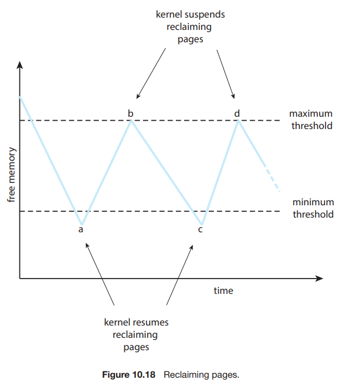

# 5. Alocation of Frames

1. Minimum Number of Frames
2. Allocation Algorithms
3. Global versus Local Allocation
4. Non Uniform Memory Access

---

- 고정된 양의 free frame list를 가지고 있을 때 어떻게 frame을 할당할 것인가?

#### simple case

- 총 128 frame
    - 35 frame : OS
    - 93 frame : user process
- demand paging을 사용
- 93 frame을 모두 free frame list에 둠
- user proces 가 시작되면 93번의 page fault가 일어나고,
- page-replacement 알고리즘에 의해 94번째 frame을 할당함
- process가 끝나면 93개의 frame이 free frame list에 들어감

#### 변형 : OS가 buffer, table space를 사용

- 3개의 free frame을 항상 넣어둠
- page fault 발생 시 buffer에서 가져올 수 있음

## 1. Minimum Number of Frames

- process가 실행되기 위해 필요한 최소한의 frame 수를 지정 (computer architecture에 의존)
- process에 할당된 frame 수가 적을수록
    - page fault 발생 빈도가 높아짐 -> process 실행 속도가 느려짐
- process당 최대 frame 수는 physical memory의 크기에 의존

## 2. Allocation Algorithms

### equal allocation : 각 process에 동일한 수의 frame을 할당

- 가장 쉬운 방법 _m/n_ (m : frame 수, n : process 수)
    - e.g. 93 frame, 5 process -> 18 frame 씩 할당
- 한계 : 각 process는 다양한 크기의 memory를 원함

### proportional allocation : process의 크기에 비례하여 frame을 할당

- 프로세스의 사이즈에 따라 frame을 할당
- e.g. 총 62 frame, 2 process
    - 한 process에 10 pages, 4 frames
    - 다른 process에 57 pages, 57 frames

### process 우선순위에 비례하여 frame을 할당

- 사이즈로 비교하면 프로세스의 우선순위가 전혀 고려되지 않음
- 더 높은 우선순위에 더 많은 frame을 할당하여 실행 속도를 높임

## 3. Global versus Local Allocation

- global replacement : 프로세스가 모든 프레임 중에서 선택
    - 프로세스가 다른 프로세스의 frame을 가질 수 있음
    - 다른 프로세스로부터 영향을 받음
    - 일반적으로 사용됨
- Local replacement : 프로세스가 자신의 프레임 중에서만 선택
    - 사용할 수 있는 메모리 페이지가 적으므로 전체 성능에 제한이 있음

#### global replacement 사용 전략

- 메모리 여유 공간의 최소값을 정해둠
- **reapers** : 메모리 여유 공간이 최소값 밑으로 떨어지면 모든 프로세스로부터 페이지를 가져옴
    - page 교체 알고리즘을 일으킴 (일반적으로 LRU Approximation 사용)
        - 최대임계치에 도달하지 못하면 더 강력한 알고리즘 사용 (FIFO, Linux OOM killer)
    - 최솟값을 넘길때까지
    - 최대 임계점에 도달하면 reapers를 중지함

## 4. Non Uniform Memory Access