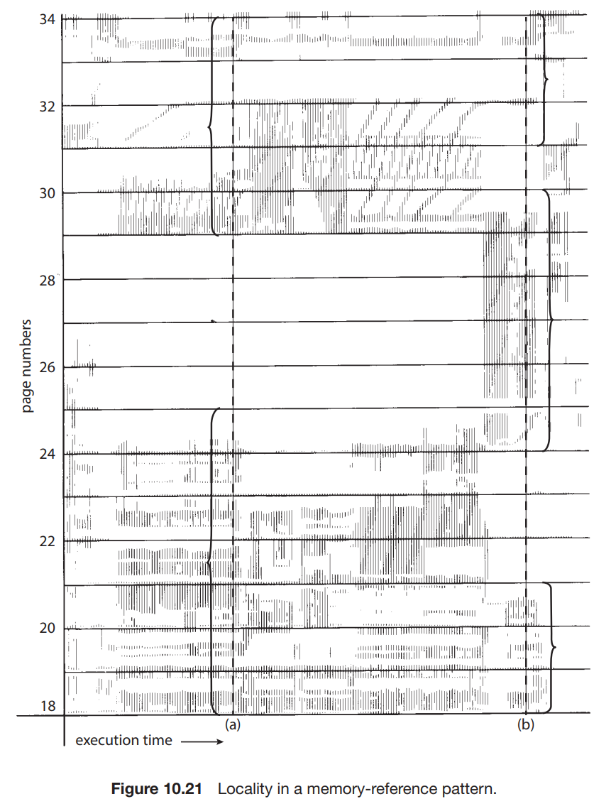
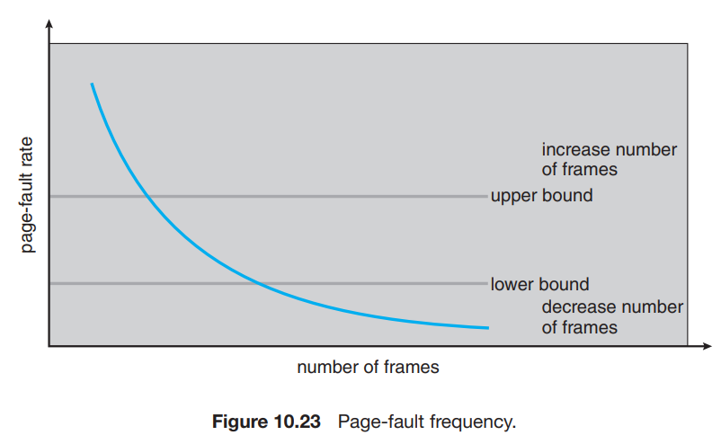

# 6. Thrashing

1. Cause of Thrashing
2. Working-Set Model
3. Page-Fault Frequency
4. Current Practice

---

- 프로세스가 충분한 frame을 갖지 못할 때, page-fault가 발생해도 여유 page가 없다면?
- **thrashing** : 프로세스가 실제로 일을 하지 않고, page-fault가 반복해서 일어남
    - 문제점 : 실제 실행시간보다 페이징하는데 더 많은 시간이 소요됨 -> 성능 문제

## 1. Cause of Thrashing

### 시나리오 global page-replacement algorithm : 멀티 프로그래밍이 높아져서 page fault가 늘어남


1. OS가 CPU 활용률을 모니터링 중 -> CPU 사용률이 너무 낮으면 멀티프로그래밍 높임
2. 더 많은 프로세스로부터 page fault 발생, 필요한 프레임들이 많아짐
3. paging device에 page 요청을 queue로 관리
4. paging device queue가 빔
5. 실제 CPU 사용률이 낮아짐 -> **CPU 스케쥴러가 멀티 프로그래밍을 높임**
6. 악순환 : CPU 사용률이 낮아지고, page fault가 더 많이 발생하고 CPU 스케쥴러는 멀티 프로그래밍을 높임

### 해결책 : Local replacement algorithm or Priority replacement algorithm

- Local replacement algorithm은 자신의 frame 에서만 page replacement를 수행
    - 하나의 프로세스에서 Thrashing이 발생해도 다른 프로세스에 영향을 주지 않음
- **문제점** : 전체 service time은 여전히 낮음

#### 해결책 : locality model



- Local replacement algorithm에서 프로세스가 필요한 만큼의 frame을 할당시킴
- 프로세스가 실제로 얼마나 많은 frame을 사용하는지 모니터링
- locality : **공통적으로** 활발하게 사용되는 page 집합
    - 프로세스는 보통 여러 locality를 가지고, locality는 overlap될 수 있음
        - overlap : 글로벌 변수 등
        - 위 그림에서 page number 18, 19, 20은 _a_ 와 _b_ 의 locality에 모두 속함

## 2. Working-Set Model


- locality 기반
- **working-set** : 가장 최근 page reference 들의 집합 (= locality 근사치)
    - 페이지가 사용 중이면 working-set에 포함
    - 페이지가 사용되지 않으면 working-set에서 제거
- 파라미터 **working-set window** Δ : working-set의 크기를 결정
    - 위 그림에서 Δ = 10
    - t1에는 {1, 2, 5, 6, 7}, t2에는 {3, 4}
- Δ 값에 정확도가 결정
    - Δ 너무 작으면 : locality를 모두 포함 못함
    - Δ 너무 크면 : locality가 겹침
    - Δ 무한대로 크면 : 프로세스 실행중 사용한 모든 페이지 집합

````
D = ∑ WSSi
````

- `D` : 모든 프로세스의 working-set size 총 합
- `WSSi` : 프로세스 i의 working-set size
- `D`가 전체 프레임 수보다 크면, thrashing이 발생

#### OS 적용

- OS는 각 프로세스의 working set을 모니터링,
    - 프로세스마다 working-set size 만큼의 frame을 할당
- 여분의 frame이 남으면, 다른 프로세스에 할당
- working-set size 총 합이 전체 사용가능 frame 수를 초과하면,
    1. OS는 중지할 process를 선택
    2. 프로세스 page를 swapped
    3. frame을 다른 프로세스에 할당

#### 특징

- 멀티 프로그래밍을 높게 유지하면서 스레싱을 방지 가능
- CPU 활용률 최적화
- 단점 : working set을 계속 추적해야함

## 3. Page-Fault Frequency



- page-fualt rate가 너무 높으면 프로세스가 frame이 부족한 것 (Thrashing)
- page-fault rate가 너무 낮으면 프로세스가 frame이 충분한 것
- upper lmit, lower limit를 정해두고, 그 사이에 page-fault rate를 유지하도록 함
- upper limit을 초과하면, 프로세스에 frame을 더 할당
- lower limit을 넘지 못하면, 프로세스의 frame을 회수
- working-set 전략과 마찬가지로, swap out할 프로세스를 선택해야함
    - page-fault rate가 올라가지만, free frame이 없을 때

## 4. Current Practice