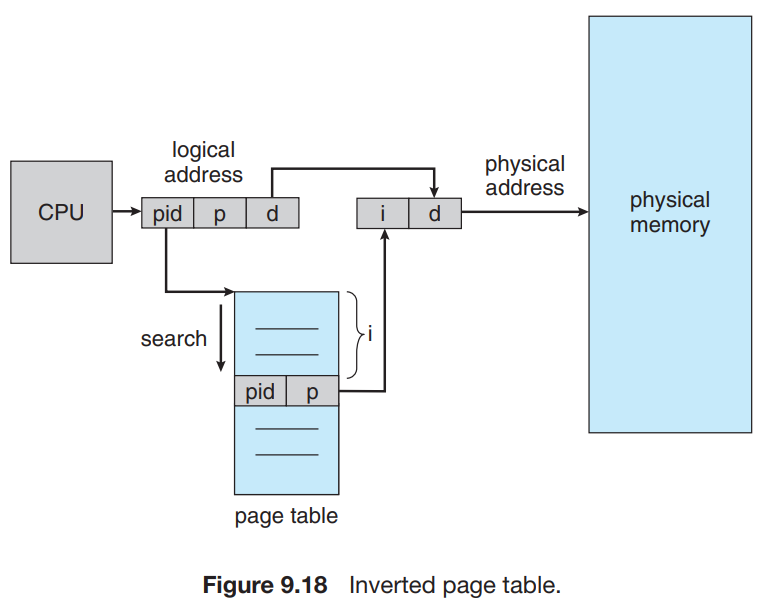

# 9. Other Considerations

1. Prepaging
2. Page Size
3. TLB Reach
4. Inverted Page Tables
5. Program Structure
6. I/O Interlock and Page Locking

---

- paging system의 가장 메인 이슈는 replacement algorithm, allocation policy
- 그 외의 고려사항들은?
    - prepaging
    - page size
    - TLB reach
    - inverted page tables
    - program structure
    - I/O interlock and page locking

## 1. Prepaging

- **Prepaging** : 메모리에서 필요할 일정량 (또는 전체)의 page를 미리 한번에 가져오는 전략
- e.g. working-set model에서 미리 process마다 page 리스트를 만들어두고, 이 리스트에 있는 page를 미리 가져옴
    - process가 중단되면 working set을 기억해두었다가 다시 시작할때 전체 page 리스트를 가져옴
- 고려사항 : prepaging 비용 vs page-fault 비용
- Linux `readahead()` system call : contents의 파일을 메모리에 prefetch

## 2. Page Size

- 새로운 머신을 설계할 때 최적의 페이지 사이즈를 결정해야함
- 2의 거듭제곱으로 정의됨 (4096 ~ 4194304 bytes)
- 페이지 사이즈가 작으면 -> 내부 fragmentation, locality 이득
- 페이지 사이즈가 크면 -> 테이블 사이즈, I/O time 이득
- 역사적으로 트렌드는 더 큰 page size

#### 고려사항 : page table 크기

- 페이지 사이즈가 작을수록 page 수가 증가
- 가상 메모리 4MB가 주어지면, 1024 bytes(1 KB) 페이지 사이즈는 4096개의 page 수를 가짐
    - 실제로는 8192 bytes(8 KB) 페이지 사이즈로 512개의 page 수를 가짐
    - 각 active process가 자신의 page table의 복사본을 가져야하기 떄문 (* 2)

#### 고려사항 : page read/write 시간, 페이지 크기

- HDD이면 I/O 시간은 탐색, 대기, 전송으로 구성 (seek, latency, transfer)
- 탐색 시간이 페이지 크기와 연관
- 총 I/O 시간에서 탐색 시간은 0.01 %
- 페이지 크기를 늘려도 I/O 시간은 크게 변화하지 않음

#### 고려사항 : 페이지 크기

- 페이지 크기가 줄어들면 전체 I/O가 줄어듦 (locality 증가)
- 각 페이지의 program locality 정확도가 올라감
- e.g. 200KB 크기의 process가 100KB 를 실행 중이면,
    - 큰 페이지를 하나 가지고 있으면, page 전체를 가져와 200KB 전체를 transfer, allocate
    - 1byte page를 가지고 있으면, 100KB만 가져와 100KB만 transfer, allocate
- 페이지 크기가 작을수록 page fault 수가 늘어남
    - page fault 오버헤드 : 인터럽트, register 저장, page 교체, queueing, table 업데이트

## 3. TLB Reach

- TLB (Translation Lookaside Buffer) : page table의 일부를 저장하는 cache
- TLB **hit ratio** : 가상주소 변환이 page table이 아닌 TLB에서 일어나는 비율
- hit ratio는 TLB entiry 수에 비례
- TLB 관련 메모리는 비용이 비쌈

#### TLB Reach

- **TLB Reach** : TLB가 접근할 수 있는 메모리 공간 (page size의 배수의 entiry 수)
- 방법 1 : working set을 TLB에 저장
    - working set이 TLB에 저장됨
    - TLB에 없으면, 프로세스는 page table을 통해 메모리 참조를 일으킴
    - memory-intesive application은 비효율 적인 방법
- 방법 2 : page size를 증가하거나, page size를 2배로 제공하는 방법
    - page size를 증가하면 (4KB -> 16KB) TLB reach가 4배로 증가
    - 큰 page size를 요구하지 않는 application에서는 fragmentaion 증가
    - e.g. Linux는 4KB 페이지 사이즈를 제공하고, **huge page** 를 (더큰 사이즈의 page) 제공

#### 예시 : ARMv8 architecture

- page와 region들의 크기가 서로 다름
- 각 TLB entry에 **contiguous bit**을 둠
- 특정 TLB entry에 있는 contiguous bit은 연속적인 메모리 block에 매핑됨
    - 방법 1. 64-KB TLB entryf를 16 * 4KB 근접 block으로 구성
    - 방법 2. 1-GB TLB entry를 32 * 32MB 근접 block으로 구성
    - 방법 3. 2-MB TLB entry를 32 * 64KB 혹은 128 * 16KB 근접 block으로 구성

## 4. Inverted Page Tables



- 물리 메모리의 page마다 entry에 매핑되는 하나의 table
- 가상 메모리와 physical frame간의 매핑 정보를 table에 저장

#### external page table(각 process마다 가지는 page table)

- Inverted Page Table 단점 : process의 가상 주소 공간에 대한 완전한 벙보를 포함하지 않음
- 참조가 일어난 페이지가 memory에 있는지 알 수 없음
- 따라서 external page talbe(각 process마다 가지는 page table)을 유지해야함
    - 전통적인 page table과 비슷
    - virtual page의 위치를 저장
- external page table은 page fault 시에만 사용

## 5. Program Structure

- demand paging은 메모리 구조를 분석하여 잘 설계할수록 시스템 성능이 좋아짐

#### 예시 : - 1 page 크기가 128 word 일 때

- `data`는 1 row당 1 page를 사용

````
int i, j;
int[128][128] data;

for (j = 0; j < 128; j++)
    for (i = 0; i < 128; i++)
        data[i][j] = 0;
````

- `data[0][0], data[1][0], data[2][0], ...` 순으로 메모리에 올라감
- 각 페이지마다 0씩 초기화하면서 시작
- 문제 : OS가 128 frame 미만으로 할당하면, 16,384 (128 * 128) page fault가 발생

````
int i, j;
int[128][128] data;
for (i = 0; i < 128; i++)
    for (j = 0; j < 128; j++)
        data[i][j] = 0;
````

- `data[0][0], data[0][1], data[0][2], ...` 순으로 메모리에 올라감
- 다음 페이지를 할당하기 전에, 이전 페이지를 모두 0으로 초기화

#### compiler와 loader 성능

- code와 data를 분리하면, code page는 read-only로 설정 가능
- clean page는 page-out 할 필요가 없음
    - clean page : page가 disk에 있는 것과 동일한 내용을 가지고 있는 page
- loader는 page boundary를 가로지르는 routine을 피함

## 6. I/O Interlock and Page Locking